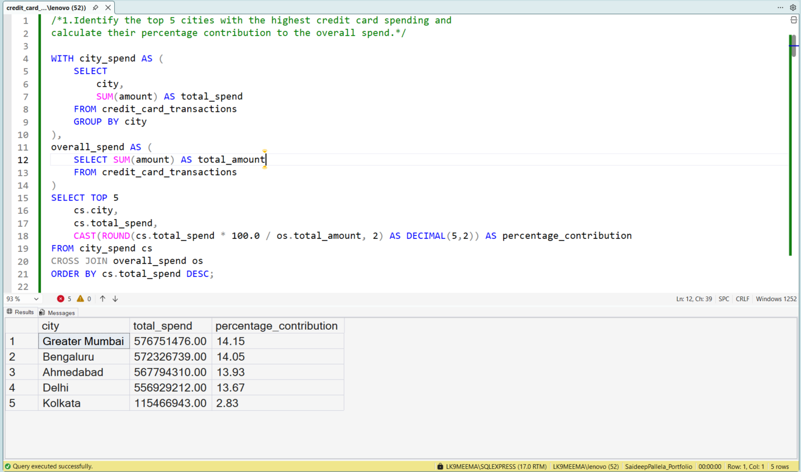
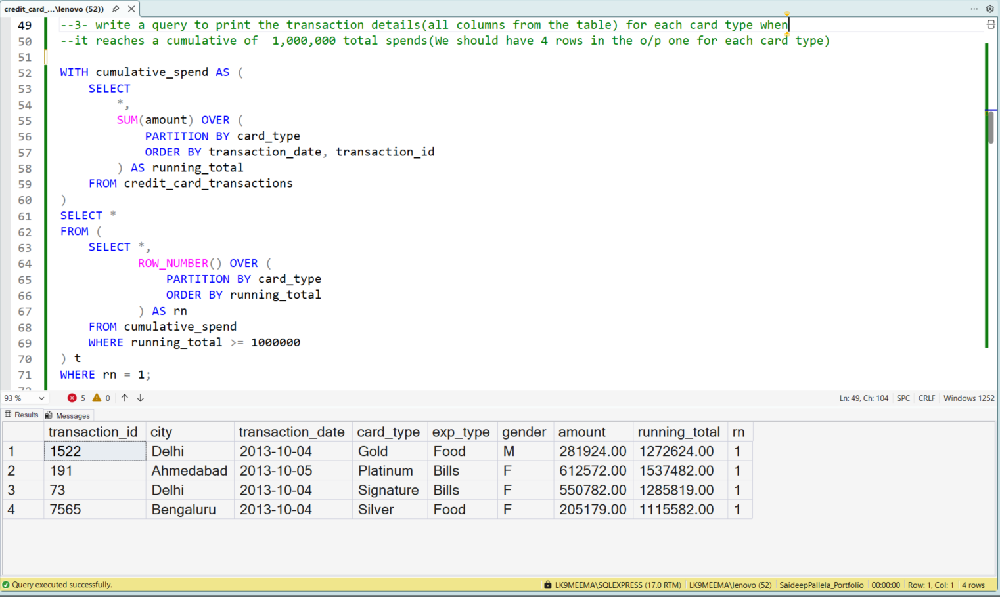
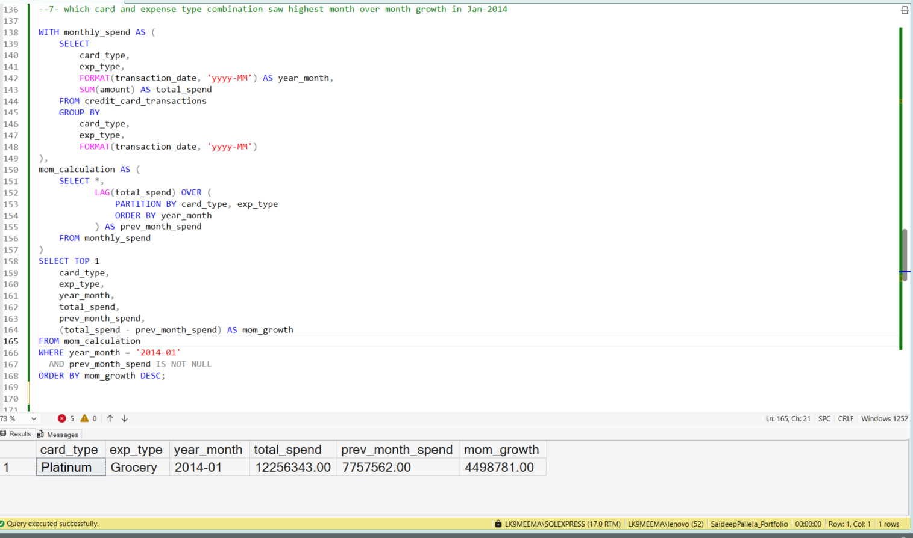

# 💳 Credit Card Transactions Analysis

  

---

## 🚀 Context

In a product or fintech environment, understanding how users spend is critical for driving revenue, retention, and growth.

This project analyzes credit card transaction data to identify **where revenue is concentrated, how customers behave, and what patterns indicate growth opportunities**.

---

## 🎯 Problem Framing

Instead of exploring data randomly, I approached this with business questions:

- Which cities drive the majority of revenue?
- Which customer segments contribute most to spending?
- What patterns indicate growth or decline?
- How quickly do different markets generate transactions?

---

## 📊 Representative Analysis Outputs

### 🔹 Revenue Concentration — Top Cities

### 🔹 Customer Value Accumulation — Cumulative Spend

### 🔹 Growth Signals — Month-over-Month Analysis

---

## 🧠 What This Analysis Reveals

- Revenue is highly concentrated in a few metropolitan cities  
- Customer behavior varies significantly across spending categories  
- Certain segments show strong growth patterns over time  
- Transaction velocity differs across regions, indicating engagement levels  

---

## ⚙️ Technical Approach

The analysis was implemented using **T-SQL in Microsoft SQL Server**, focusing on clarity and scalability:

- **Window Functions** → `ROW_NUMBER`, `RANK`, `LAG` for ranking & trend analysis  
- **Aggregations** → Revenue distribution and KPI calculations  
- **CTEs** → Modular and readable query structure  
- **Conditional Logic** → Customer segmentation  
- **Date Functions** → Time-based trend analysis  

---

## 📁 Project Assets

- `queries.sql` → Complete SQL implementation  
- `screenshots/` → Output results for key analyses  
- `credit_card_analysis.pdf` → Detailed walkthrough (optional)  

---

## 💡 What This Demonstrates

- Ability to translate raw data into **business questions**
- Strong foundation in **analytical SQL (beyond basics)**
- Focus on **decision-making, not just query writing**
- Structured approach to solving real-world data problems  

---

## 👤 Author

**Saideep Pallela**  
Aspiring Data Analyst| Excel | SQL | Power BI
