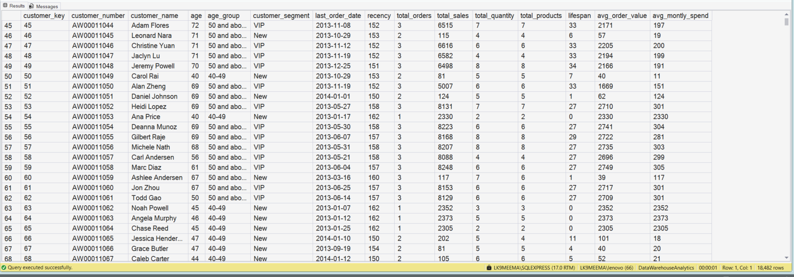
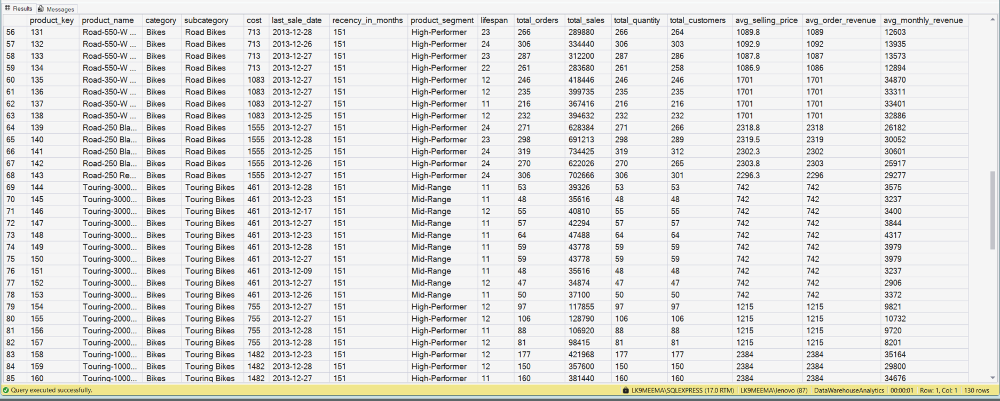

<div align="center">

# 📊 End-to-End Business Analytics with Microsoft SQL Server

### Transforming Transactional Sales Data into Reusable Customer & Product Reporting Solutions

<p align="center">


<br>


</p>

<p align="center">

📂 <strong>13 SQL Scripts</strong> • 📊 <strong>2 Analytical Reports</strong> • 🗄️ <strong>3 Database Tables</strong> • 📄 <strong>1 Project Guide</strong>

</p>

</div>

---

# 📋 Executive Summary

This repository presents an end-to-end business analytics project developed using **Microsoft SQL Server** and **SQL Server Management Studio (SSMS)**.

The project demonstrates how raw transactional sales data can be transformed into reusable analytical reporting solutions through database exploration, exploratory data analysis (EDA), advanced Transact-SQL (T-SQL), and business-focused reporting.

Instead of treating SQL as a collection of standalone queries, the project follows a structured workflow that builds reusable SQL Server Views for customer analytics and product performance reporting.

By combining clean SQL development, analytical thinking, and business reporting practices, this repository showcases how SQL can be used to convert transactional data into meaningful insights that support informed business decision-making.

---

# Business Scenario

Imagine joining a retail organization where thousands of sales transactions are recorded every day.

Although the database stores valuable information, decision-makers cannot easily answer questions such as:

- Which customers generate the highest revenue?
- Which products consistently perform well?
- Which customers are becoming inactive?
- What is the average value of an order?
- Which products contribute most to total sales?
- How can these insights be generated consistently without rewriting SQL every time?

These challenges require more than basic SQL queries—they require reusable analytical solutions.

This project demonstrates how Microsoft SQL Server can be used to build those solutions.

---

# Project Objectives

<table>

<tr>
<th width="35%">Objective</th>
<th>Description</th>
</tr>

<tr>
<td>🗄 Database Exploration</td>
<td>Understand the SQL Server database structure, schemas, tables and relationships before beginning analysis.</td>
</tr>

<tr>
<td>🔎 Exploratory Data Analysis</td>
<td>Investigate customer, product and sales data to understand business behaviour and identify analytical opportunities.</td>
</tr>

<tr>
<td>🧠 Advanced SQL Development</td>
<td>Develop maintainable SQL using joins, aggregations, Common Table Expressions (CTEs), CASE expressions and Window Functions.</td>
</tr>

<tr>
<td>📊 Customer Analytics</td>
<td>Create reusable SQL Server Views that summarize customer purchasing behaviour and business KPIs.</td>
</tr>

<tr>
<td>📦 Product Analytics</td>
<td>Develop reporting views that evaluate product performance using meaningful business metrics.</td>
</tr>

<tr>
<td>💼 Business Reporting</td>
<td>Transform transactional data into reusable reporting assets that support business decision-making.</td>
</tr>

</table>

---

# 💡 Engineering Mindset

This project was developed with a simple philosophy:

> **Move beyond solving SQL questions and build complete analytical solutions.**

Instead of treating SQL as a collection of individual queries, each script in this repository contributes to a structured workflow.

The development process follows a logical progression:

```
Understand the Database
        │
        ▼
Explore Business Data
        │
        ▼
Develop Analytical SQL
        │
        ▼
Build Reusable SQL Views
        │
        ▼
Support Business Decisions
```

This approach reflects the way SQL is commonly applied in professional analytics environments, where maintainability, readability and business value are just as important as query correctness.

---

# 📊 Project at a Glance

| Category | Details |
|-----------|---------|
| 🗄 Database Platform | Microsoft SQL Server |
| 💻 Development Environment | SQL Server Management Studio (SSMS) |
| 📝 Query Language | T-SQL |
| 📜 SQL Scripts | 13 |
| 📂 Database Tables | 3 |
| 👥 Customer Reporting Views | 1 |
| 📦 Product Reporting Views | 1 |
| 📄 Project Documentation | SQL_EDA_Advanced_Analytics.pdf |
| 📁 Source Data | CSV |

---
# 🛠 Technology Stack

This project was developed using Microsoft's SQL ecosystem to transform raw transactional data into meaningful business insights.

| Category | Technology |
|-----------|------------|
| **Database Platform** | Microsoft SQL Server |
| **Development Environment** | SQL Server Management Studio (SSMS) |
| **Query Language** | Transact-SQL (T-SQL) |
| **Data Source** | CSV Files |
| **Database Objects** | Tables, Views |
| **Version Control** | Git & GitHub |
| **Project Documentation** | Markdown & PDF |

---

# ⚙ SQL Development Workflow

The project was developed using a structured workflow that mirrors how SQL is applied in real-world analytics projects.

```text
Raw CSV Files
       │
       ▼
Import Data into SQL Server
       │
       ▼
Explore Database Structure
       │
       ▼
Perform Exploratory Data Analysis
       │
       ▼
Develop Advanced SQL Queries
       │
       ▼
Build Customer Analytics Report
       │
       ▼
Build Product Analytics Report
       │
       ▼
Generate Business Insights
```

Each SQL script builds upon the previous one, gradually progressing from data exploration to reusable analytical reports.

---

# 📂 Repository Structure

```text
Business-Analytics-SQL-Server/
│
├── datasets/
│
├── sql/
│   ├── 01_database_exploration.sql
│   ├── 02_database_exploration.sql
│   ├── 03_dimensions_exploration.sql
│   ├── 04_date_range_exploration.sql
│   ├── 05_measure_exploration.sql
│   ├── 06_magnitude_analysis.sql
│   ├── 07_ranking_analysis.sql
│   ├── 08_change_over_time.sql
│   ├── 09_cumulative_analysis.sql
│   ├── 10_performance_analysis.sql
│   ├── 11_data_segmentation.sql
│   ├── 12_customer_report.sql
│   └── 13_product_report.sql
│
├── documentation/
│   └── SQL_EDA_Advanced_Analytics.pdf
│
├── outputs/
│
└── README.md
```

---

# 🧠 SQL Concepts Demonstrated

Throughout this project, a variety of SQL concepts were applied to answer business questions and build reusable reporting solutions.

| Area | Concepts |
|------|----------|
| **Database Exploration** | Database objects, schema exploration |
| **Data Analysis** | Filtering, Sorting, Grouping, Aggregations |
| **Joins** | INNER JOIN, LEFT JOIN |
| **Conditional Logic** | CASE Expressions |
| **Advanced SQL** | Common Table Expressions (CTEs) |
| **Window Functions** | ROW_NUMBER(), RANK(), DENSE_RANK(), LAG(), LEAD() |
| **Analytical Techniques** | Running Totals, Rankings, Trend Analysis |
| **Business Reporting** | Customer Analytics, Product Analytics |
| **Code Quality** | Modular, readable and reusable SQL scripts |

---

# 📊 Customer Analytics Report

## 🎯 Business Objective

Customer analytics helps organizations understand purchasing behaviour, identify high-value customers, and support data-driven decision-making.

The objective of this report is to transform raw transactional sales data into a reusable customer-level analytical view using **Microsoft SQL Server**. The final report consolidates key customer metrics, performance indicators, and segmentation logic into a single business-ready dataset that can support business reporting and analysis.

---

## ❓ Business Questions Answered

This report is designed to answer the following business questions:

- Who are the highest-value customers?
- Which customers should be classified as **VIP**, **Regular**, or **New**?
- How many orders has each customer placed?
- How much revenue has each customer generated?
- How many unique products has each customer purchased?
- How long has each customer been active?
- When was the customer's most recent purchase?
- What is each customer's average order value?
- What is each customer's average monthly spend?

---

## 📌 Report Summary

| Category | Details |
|----------|---------|
| **Report Name** | Customer Analytics Report |
| **Database Platform** | Microsoft SQL Server |
| **Development Environment** | SQL Server Management Studio (SSMS) |
| **Database Object** | `gold.report_customers` (SQL Server View) |
| **Source Tables** | `gold.fact_sales`, `gold.dim_customers` |
| **Output Level** | One record per customer |
| **Business Purpose** | Customer segmentation and KPI reporting |

---

## 🧠 SQL Concepts Applied

| SQL Concept | Purpose |
|-------------|---------|
| **LEFT JOIN** | Combine customer and sales information |
| **Common Table Expressions (CTEs)** | Organize the solution into logical and reusable steps |
| **Aggregation Functions** | Calculate customer-level metrics |
| **CASE Expressions** | Classify customers into business segments and age groups |
| **DATEDIFF()** | Calculate customer age, lifespan, and purchase recency |
| **COUNT(DISTINCT)** | Calculate unique orders and products purchased |
| **CREATE VIEW** | Create a reusable SQL Server reporting view |

---

## ⚙ SQL Development Approach

The report was developed using a layered SQL approach to improve readability, maintainability, and reusability.

### **Step 1 — Base Query**

Retrieve the essential customer and transactional sales information required for analysis.

### **Step 2 — Customer Aggregation**

Aggregate transactional data at the customer level to calculate key business metrics such as total orders, total sales, customer lifespan, and quantity purchased.

### **Step 3 — Final Customer Report**

Generate a reusable SQL Server view by calculating KPIs, customer segments, age groups, average order value, and average monthly spend.

---

# 💻 SQL Solution

```sql
CREATE VIEW gold.report_customers AS

WITH base_query AS
(
    SELECT
        f.order_number,
        f.product_key,
        f.order_date,
        f.sales_amount,
        f.quantity,
        c.customer_key,
        c.customer_number,
        CONCAT(c.first_name,' ',c.last_name) AS customer_name,
        DATEDIFF(YEAR,c.birthdate,GETDATE()) AS age

    FROM gold.fact_sales f

    LEFT JOIN gold.dim_customers c
        ON c.customer_key = f.customer_key

    WHERE order_date IS NOT NULL
),

customer_aggregation AS
(
    ...
)
```

<details>
<summary><b>📄 View Complete SQL Script</b></summary>

<br>

The complete SQL implementation is available in the following SQL script:

➡️ **[12_advanced_customers_report.sql](12_advanced_customers_report.sql)**

</details>

---

## 📈 Report Metrics

The final report generates the following customer-level metrics:

- Customer Segment
- Age Group
- Total Orders
- Total Sales
- Total Quantity Purchased
- Total Products Purchased
- Customer Lifespan (Months)
- Purchase Recency (Months)
- Average Order Value (AOV)
- Average Monthly Spend

---

# 📷 Report Output

<p align="center">
  
</p>

<p align="center">
<i><b>Figure 1.</b> Customer Analytics Report generated from the SQL Server view <code>gold.report_customers</code>.</i>
</p>

---

# 🔍 Business Insights

The report consolidates customer purchasing behaviour into a single analytical view, making it easier to identify business trends and evaluate customer value.

Some of the insights that can be derived include:

- Identifying high-value customers through customer segmentation.
- Measuring customer purchasing activity using total orders and revenue.
- Understanding product engagement through unique product purchases.
- Evaluating customer retention using lifespan and purchase recency.
- Measuring spending behaviour using Average Order Value (AOV).
- Comparing long-term customer value using Average Monthly Spend.
- Supporting demographic analysis through age group classification.

---

# 💼 Business Value

This report can support several business functions, including:

- Customer Segmentation
- Customer Retention Analysis
- Loyalty Program Design
- Targeted Marketing Campaigns
- Revenue Performance Monitoring
- Executive KPI Reporting
- Customer Lifetime Value Analysis

By consolidating customer information into a reusable SQL Server view, business users can query a single reporting object instead of repeatedly writing complex joins and aggregations.

---

# 📦 Product Performance Analytics Report

## 🎯 Business Objective

Product performance analysis enables businesses to understand how products contribute to overall sales, identify top-performing products, and uncover opportunities for inventory optimization and revenue growth.

The objective of this report is to transform raw transactional sales data into a reusable product-level analytical view using **Microsoft SQL Server**. The final report consolidates product performance metrics, revenue indicators, and product segmentation into a single business-ready dataset.

---

## ❓ Business Questions Answered

This report is designed to answer the following business questions:

- Which products generate the highest revenue?
- Which products should be classified as **High-Performers**, **Mid-Range**, or **Low-Performers**?
- How many orders include each product?
- How much revenue has each product generated?
- How many units of each product have been sold?
- How many unique customers purchased each product?
- How long has each product been actively sold?
- When was each product last sold?
- What is the average revenue generated per order?
- What is the average monthly revenue generated by each product?

---

## 📌 Report Summary

| Category | Details |
|----------|---------|
| **Report Name** | Product Performance Analytics Report |
| **Database Platform** | Microsoft SQL Server |
| **Development Environment** | SQL Server Management Studio (SSMS) |
| **Database Object** | `gold.report_products` (SQL Server View) |
| **Source Tables** | `gold.fact_sales`, `gold.dim_products` |
| **Output Level** | One record per product |
| **Business Purpose** | Product performance analysis and KPI reporting |

---

## 🧠 SQL Concepts Applied

| SQL Concept | Purpose |
|-------------|---------|
| **LEFT JOIN** | Combine product and sales information |
| **Common Table Expressions (CTEs)** | Organize the solution into logical and reusable steps |
| **Aggregation Functions** | Calculate product-level performance metrics |
| **CASE Expressions** | Categorize products based on revenue performance |
| **DATEDIFF()** | Calculate product lifespan and sales recency |
| **COUNT(DISTINCT)** | Calculate unique orders and customers |
| **ROUND()** | Calculate average selling price |
| **CREATE VIEW** | Create a reusable SQL Server reporting view |

---

## ⚙ SQL Development Approach

The report was developed using a layered SQL approach to improve readability, maintainability, and reusability.

### **Step 1 — Base Query**

Retrieve the essential product and transactional sales information required for analysis.

### **Step 2 — Product Aggregation**

Aggregate transactional records to calculate product-level metrics such as total sales, total orders, total quantity sold, customer count, product lifespan, and average selling price.

### **Step 3 — Final Product Report**

Generate a reusable SQL Server view by calculating KPIs, product segments, recency, average order revenue, and average monthly revenue.

---

# 💻 SQL Solution

```sql
CREATE VIEW gold.report_products AS

WITH base_query AS
(
    SELECT
        f.order_number,
        f.order_date,
        f.customer_key,
        f.sales_amount,
        f.quantity,
        p.product_key,
        p.product_name,
        p.category,
        p.subcategory,
        p.cost

    FROM gold.fact_sales f

    LEFT JOIN gold.dim_products p
        ON f.product_key = p.product_key

    WHERE order_date IS NOT NULL
),

product_aggregations AS
(
    ...
)
```

<details>

<summary><b>📄 View Complete SQL Script</b></summary>

<br>

The complete SQL script used to generate this report can be accessed below:

➡️ **[13_advanced_products_report.sql](13_advanced_products_report.sql)**

</details>

---

## 📈 Report Metrics

The final report generates the following product-level metrics:

- Product Segment
- Product Category
- Product Subcategory
- Total Orders
- Total Sales
- Total Quantity Sold
- Total Unique Customers
- Product Lifespan (Months)
- Sales Recency (Months)
- Average Selling Price
- Average Order Revenue (AOR)
- Average Monthly Revenue

---

# 📷 Report Output

<p align="center">
  
</p>

<p align="center">
<i><b>Figure 2.</b> Product Performance Analytics Report generated from the SQL Server view <code>gold.report_products</code>.</i>
</p>

---

# 🔍 Business Insights

The report transforms transactional sales data into a product-level analytical view, making it easier to evaluate product performance and identify revenue-driving products.

Some of the insights that can be derived include:

- Identifying high-performing, mid-range, and low-performing products based on revenue.
- Measuring product demand through total orders and quantity sold.
- Evaluating customer reach using the number of unique customers purchasing each product.
- Monitoring product lifecycle using lifespan and sales recency.
- Comparing pricing performance using the average selling price.
- Measuring revenue efficiency using Average Order Revenue (AOR).
- Tracking long-term product performance using Average Monthly Revenue.

---

# 💼 Business Value

This report supports a variety of business functions, including:

- Product Performance Analysis
- Product Portfolio Evaluation
- Revenue Analysis
- Inventory Planning
- Sales Performance Monitoring
- Product Lifecycle Analysis
- Executive KPI Reporting

By consolidating product performance metrics into a reusable SQL Server view, business users can analyze product trends without repeatedly writing complex SQL queries, enabling faster and more consistent business reporting.

---
# 📚 Learning Outcomes

Developing this project strengthened both my technical SQL skills and my understanding of how analytical solutions are built in real-world business environments.

Throughout this project, I gained practical experience in:

- Designing reusable SQL Server Views for business reporting
- Building analytical solutions using Common Table Expressions (CTEs)
- Applying Window Functions to solve analytical problems
- Writing clean, modular, and maintainable Transact-SQL (T-SQL)
- Transforming transactional sales data into business-ready reports
- Developing customer and product analytical reports
- Calculating business KPIs using SQL
- Organizing SQL projects using a structured development workflow
- Documenting an end-to-end analytics project from start to finish

More importantly, this project helped me transition from solving individual SQL exercises to developing complete analytical solutions that address real business requirements.

The experience reinforced the importance of writing SQL that is not only correct, but also readable, reusable, maintainable, and valuable for business decision-making.

---

# 📄 Project Documentation

Alongside the SQL scripts, I documented the complete development process followed throughout this project.

The documentation captures the project from beginning to end, including:

- Project objectives
- Dataset understanding
- SQL development workflow
- Query explanations
- Analytical approach
- Business insights
- Supporting screenshots
- Key learnings and observations

It serves as a companion guide to this repository and provides additional context behind the SQL implementation and reporting process.

📘 **Project Documentation**

➡️ **[SQL_EDA_Advanced_Analytics.pdf](SQL_EDA_Advanced_Analytics.pdf)**

---

# 👨‍💻 About Me

Hi, I'm **Saiidheep Pallela**, an aspiring Data Analyst focused on building practical analytics projects using **Microsoft SQL Server**, **Excel**, and **Power BI**.

I enjoy transforming raw data into meaningful business insights through structured SQL development, analytical thinking, and clear documentation. Every project in this portfolio is an opportunity to strengthen my technical skills while solving real-world business problems.

---

# 🤝 Let's Connect

I'm always open to connecting with recruiters, data professionals, and fellow learners. Feel free to explore my work or connect with me.

<div align="center">

<a href="https://www.linkedin.com/in/saideeppallela">
  
</a>

&nbsp;&nbsp;

<a href="https://github.com/saideeppallela">
  
</a>

</div>

---

<div align="center">

# ⭐ Thank You

Thank you for taking the time to explore this project.

This repository showcases an end-to-end SQL Server analytics workflow—from exploring transactional data and developing analytical SQL queries to creating reusable reporting views for business decision-making.

I hope this project demonstrates not only my SQL skills, but also my ability to approach business problems with structured analysis, clean documentation, and maintainable solutions.

### 🌟 If you found this project interesting, please consider giving it a Star!

Your support motivates me to continue building practical data analytics projects and sharing my learning with the community.

Thank you for your time and consideration.

</div>
